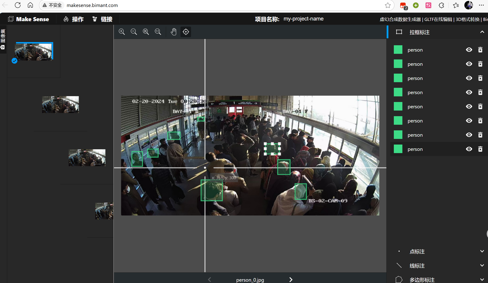

# 草履虫DQYのYOLO速通术

> 本项目出于学习YOLO目的，复刻自[BRT Crowd Analysis System by Hassan Raza](https://github.com/hassanrrraza/crowd-analysis-yolo)

本项目仅用于记录本人YOLO学习的过程
啊，我速通YOLO，真的假的，要上吗？

## 数据准备

### 数据集
1. 提取视频帧，用于训练YOLO模型
    ```bash
    python .\src\utils\ImageExtractor.py --video test.mp4 --output dataset/images/train
    ```
2. 使用LabelImg等目标检测标注工具，标注目标

（或者在roboflow等网站下载数据集）

### 数据集格式要求
YOLOv8 的数据集需满足以下结构：
```
dataset/
├── images/
│   ├── train/      # 训练图像
│   └── val/        # 验证图像
└── labels/
    ├── train/      # 训练标注文件
    └── val/        # 验证标注文件
```
每个标注文件（.txt）与图像文件同名

### 配置文件（data.yaml）
创建 data.yaml 文件，定义数据集路径和类别信息：
```yaml
path: ./dataset
train: images/train
val: images/val
names: ['cardboard']  # 类别名称列表
```
### 模型训练
1. 选择预训练模型
   YOLOv8 提供多种预训练模型（如 yolov8n.pt, yolov8m.pt 等），推荐从预训练模型微调以加速收敛。

2. 训练命令
   使用命令行训练模型：
   
   ```bash
   yolo detect train data=data.yaml model=yolov8n.pt epochs=100 imgsz=640 batch=16
   ```
   data: 数据集配置文件路径。
   model: 预训练模型路径（如 yolov8n.pt）。
   epochs: 训练轮数。
   imgsz: 输入图像尺寸（建议 640 或 1024）。
   batch: 批量大小（根据显存调整）。
3. Python 代码训练
   ```python
   from ultralytics import YOLO
   model = YOLO("yolov8n.pt")  # 加载预训练模型
   results = model.train(data="data.yaml", epochs=100, imgsz=640, batch=16)
   ```

4. 训练结果

   训练完成后，将在 `runs/detect/train` 目录生成结果文件，包括：

   - `results.png`：损失曲线和 mAP 曲线；

   - `weights/best.pt`：最佳模型权重；

   - `confusion_matrix.png`：混淆矩阵分析图。

   > 若 mAP@0.5 达到 90% 以上，即可用于部署。

   在深度学习领域，通常通过观察损失函数下降的曲线来评估模型的训练状态。YOLOv8训练过程中，主要包含三种损失：定位损失（box_loss）、分类损失（cls_loss）和动态特征损失（dfl_loss）。训练完成后，相关的训练记录和结果文件会保存在runs/目录下，具体内容如下：

   
   训练好的模型也会放在对应的weight文件夹下，会保存有最新的权重以及最好的权重。

   5. 模型验证与测试
      1. 在验证集上评估模型：
          ```bash
          yolo detect val model=runs/detect/train3/weights/best.pt data=data.yaml imgsz=640
         ```
      2. 预测（推理）
         对单张图像或视频进行预测：
         ```python
         # 加载模型并推理
         model = YOLO('best.pt')
         results = model('img.png', save=True, conf=0.25)
         
         # 获取保存后的图像路径
         save_path = results[0].save_dir + '\\img.jpg'
         
         # 使用 OpenCV 加载并显示图像
         img = cv2.imread(str(save_path))
         cv2.imshow('Detection Result', img)
         cv2.waitKey(0)
         cv2.destroyAllWindows()
         ```
   

## 友情链接:
- [BRT Crowd Analysis System by Hassan Raza](https://github.com/hassanrrraza/crowd-analysis-yolo)
- [Ultralytics YOLOv8](https://github.com/ultralytics/ultralytics)
- [探索Ultralytics YOLOv8 -Ultralytics YOLO 文档](https://docs.ultralytics.com/zh/models/yolov8/)
- [YOLO代码参考](https://docs.ultralytics.com/reference/cfg/__init__/)
- [roboflow下载数据集](https://public.roboflow.com/)
- [飞桨数据集](https://aistudio.baidu.com/datasetoverview)