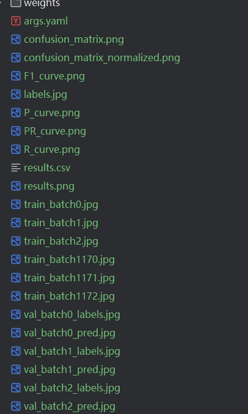

# 草履虫DQYのYOLO速通术

> 本项目出于学习YOLO目的，复刻自[BRT Crowd Analysis System by Hassan Raza](https://github.com/hassanrrraza/crowd-analysis-yolo)

本项目仅用于记录本人YOLO学习的过程
啊，我速通YOLO，真的假的，要上吗？

## 数据准备

### 数据集
1. 提取视频帧，用于训练YOLO模型
    ```bash
    python .\src\utils\ImageExtractor.py --video test.mp4 --output dataset/images/train
    ```
2. 使用LabelImg等目标检测标注工具，标注目标

（或者在roboflow等网站下载数据集）

### 数据集格式要求
YOLOv8 的数据集需满足以下结构：
```
dataset/
├── images/
│   ├── train/      # 训练图像
│   └── val/        # 验证图像
└── labels/
    ├── train/      # 训练标注文件
    └── val/        # 验证标注文件
```
每个标注文件（.txt）与图像文件同名

### 配置文件（data.yaml）
创建 data.yaml 文件，定义数据集路径和类别信息：
```yaml
path: ./dataset
train: images/train
val: images/val
names: ['cardboard']  # 类别名称列表
```
### 模型训练
1. 选择预训练模型
   YOLOv8 提供多种预训练模型（如 yolov8n.pt, yolov8m.pt 等），推荐从预训练模型微调以加速收敛。

2. 训练命令
   使用命令行训练模型：
   
   ```bash
   yolo detect train data=data.yaml model=yolov8n.pt epochs=100 imgsz=640 batch=16
   ```
   data: 数据集配置文件路径。
   model: 预训练模型路径（如 yolov8n.pt）。
   epochs: 训练轮数。
   imgsz: 输入图像尺寸（建议 640 或 1024）。
   batch: 批量大小（根据显存调整）。
3. Python 代码训练
   ```python
   from ultralytics import YOLO
   model = YOLO("yolov8n.pt")  # 加载预训练模型
   results = model.train(data="data.yaml", epochs=100, imgsz=640, batch=16)
   ```

4. 训练结果

   训练完成后，将在 `runs/detect/train` 目录生成结果文件，包括：

   - `results.png`：损失曲线和 mAP 曲线；

   - `weights/best.pt`：最佳模型权重；

   - `confusion_matrix.png`：混淆矩阵分析图。

   > 若 mAP@0.5 达到 90% 以上，即可用于部署。

   在深度学习领域，通常通过观察损失函数下降的曲线来评估模型的训练状态。YOLOv8训练过程中，主要包含三种损失：定位损失（box_loss）、分类损失（cls_loss）和动态特征损失（dfl_loss）。训练完成后，相关的训练记录和结果文件会保存在runs/目录下，具体内容如下：

   
   训练好的模型也会放在对应的weight文件夹下，会保存有最新的权重以及最好的权重。

   5. 模型验证与测试
      1. 在验证集上评估模型：
          ```bash
          yolo detect val model=runs/detect/train3/weights/best.pt data=data.yaml imgsz=640
         ```
      2. 预测（推理）
         对单张图像或视频进行预测：
         ```python
         # 加载模型并推理
         model = YOLO('best.pt')
         results = model('img.png', save=True, conf=0.25)
         
         # 获取保存后的图像路径
         save_path = results[0].save_dir + '\\img.jpg'
         
         # 使用 OpenCV 加载并显示图像
         img = cv2.imread(str(save_path))
         cv2.imshow('Detection Result', img)
         cv2.waitKey(0)
         cv2.destroyAllWindows()
         ```
## 草履虫DQYのcv2速通术
> 仅用于记录本人cv2学习过程（ggq名言：我真的好无知，好无知）
> 参考：https://www.runoob.com/opencv/opencv-tutorial.html
### cv2基本操作

### 1、图片加载、显示和保存

- **cv2.imread(filename, flags) ：读取加载图片**
  - **cv2.imshow(winname, mat) ： 显示图片**
  - **cv2.waitKey() ： 等待图片的关闭**
  - **cv2.imwrite(filename, img) ： 保存图片**

```python
import cv2

# 读取图片，第二个参数为False时，显示为灰度图像，True为原图
img = cv2.imread(filename="cat.jpg", flags=False)

# 显示图片，第一个参数为图片的标题
cv2.imshow(winname="image title", mat=img)

# 等待图片的关闭，不写这句图片会一闪而过
cv2.waitKey()

# 保存图片
cv2.imwrite("Grey_img.jpg", img)
```

>  **cv2.waitKey() ： 等待图片的关闭**
>
> 可设置参数，为多少毫秒后自动关闭
>
> ```python
> import cv2
> for file in filelist:
>     image = cv2.imread(file, flags=False)
>     cv2.imshow(winname="11",mat=image)
>     # 每隔1000ms显示一张图片
>     cv2.waitKey(1000)
> ``` 

### 2、图像显示窗口创建与销毁

- **cv2.namedWindow(winname, 属性)：创建一个窗口**
- **cv2.destroyWindow(winname)：销毁某个窗口**
- **cv2.destroyAllWindows()：销毁所有窗口**

> **winname作为窗口的唯一标识，如果想使用指定窗口显示目标图像，需要让cv2.imshow(winname)中的winname与窗口的winname需要保持一致。**
> **窗口创建时可以添加的属性：**
> - **cv2.WINDOW_NORMAL：**窗口大小可以改变（同**cv2.WINDOW_GUI_NORMAL**）
> - **cv2.WINDOW_AUTOSIZE：**窗口大小不能改变
> - **cv2.WINDOW_FREERATIO：**窗口大小自适应比例
> - **cv2.WINDOW_KEEPRATIO：**窗口大小保持比例
> - **cv2.WINDOW_GUI_EXPANDED：**显示色彩变成暗色
> - **cv2.WINDOW_FULLSCREEN：**全屏显示
> - **cv2.WINDOW_OPENGL：**支持**OpenGL**的窗口

```python
img = cv2.imread("cat.jpg")

# 第二个参数为窗口属性
cv2.namedWindow(winname="title", cv2.WINDOW_NORMAL)

# 如果图片显示想使用上面的窗口，必须保证winname一致
cv2.imshow(winname="title", img)
cv2.waitKey()
# 销毁
cv2.destroyWindow("title")

# 销毁所有窗口：
cv2.destroyAllWindows()
```

### 3、图片的常用属性的获取

- **img.shape：**打印图片的高、宽和通道数（当图片为灰度图像时，颜色通道数为1，不显示）
- **img.size：**打印图片的像素数目
- **img.dtype：**打印图片的格式
> **注意：**这几个是图片的属性，并不是调用的函数，所以后面没有‘ () ’。
```python
import cv2
img = cv2.imread("cat.jpg")
imgGrey = cv2.imread("cat.jpg", False)
print(img.shape)
print(imgGrey.shape)
#输出：
#(280, 300, 3)
#(280, 300)
print(img.size)
print(img.dtype)
#输出：
# 252000
# uint8
```

### 4、生成指定大小的矩形区域（**ROI**）
> 1. 一个图片img，它的某个像素点可以用 img[x, y, c] 表示（x，y为坐标，c为通道数）
> 2. 同理，这个图片的某个矩形区域可以表示为：img[x1:x2, y1:y2, c]（相当于截下一块矩形，左上角坐标为（x1, y1），右下角坐标为（x2, y2））
> 3. 其中 c 一般取值为0，1，2（BGR）代表第几个颜色通道，可以省略不写 img[x, y] 代表所有通道。

**实例一：生成一个大小为（300，400）颜色通道为3的红色图片**
```python
import cv2
import numpy as np
imgzero = np.zeros(shape=(300, 400, 3), dtype=np.uint8)
imgzero[:, :] = (0, 0, 255) # (B, G, R)
cv2.imshow("imgzero",imgzero)
cv2.waitKey()
```
 **实例二：从一张图片上截取一个矩形区域**

```python
import cv2
img = cv2.imread("cat.jpg")
# 输出（50，100）上的像素值
num = img[50, 100]
print(num)
# 截取部分区域并显示
region = img[50:100, 50:100]
cv2.imshow("img", region)
cv2.waitKey()
```

### 5、图片颜色通道的分离与合并

- **cv2.split(m)：**将图片m分离为三个颜色通道
- **cv2.merge(mv)：**将三个颜色通道合并为一张图片

```python
import cv2
img = cv2.imread("cat.jpg")
b, g, r = cv2.split(img)
merge = cv2.merge([b, g, r])
```

### 6、两张图片相加，改变对比度和亮度

- **cv2.add(src1, src2)：**普通相加
- **cv2.addWeighted(src1, alpha, src2, w2，beta)：**带权相加
      **src1：**第一张图片
      **alpha：**第一张图片权重
      **src2：**第二张图片
      **beta：**第二张图片权重
      **gamma：**图1与图2作和后添加的数值。
      **dst：**输出图片
```python
import cv2
img1 = cv2.imread("cat.jpg")
img2 = cv2.imread("dog.jpg")
add1 = cv2.add(img1,img2)
add2 = cv2.addWeighted(img1, 0.5, img2, 0.5, 3)
cv2.imshow("add1", add1)
cv2.imshow("add2", add2)
cv2.waitKey()
```

## 友情链接:
- [BRT Crowd Analysis System by Hassan Raza](https://github.com/hassanrrraza/crowd-analysis-yolo)
- [Ultralytics YOLOv8](https://github.com/ultralytics/ultralytics)
- [探索Ultralytics YOLOv8 -Ultralytics YOLO 文档](https://docs.ultralytics.com/zh/models/yolov8/)
- [YOLO代码参考](https://docs.ultralytics.com/reference/cfg/__init__/)
- [roboflow下载数据集](https://public.roboflow.com/)
- [飞桨数据集](https://aistudio.baidu.com/datasetoverview)